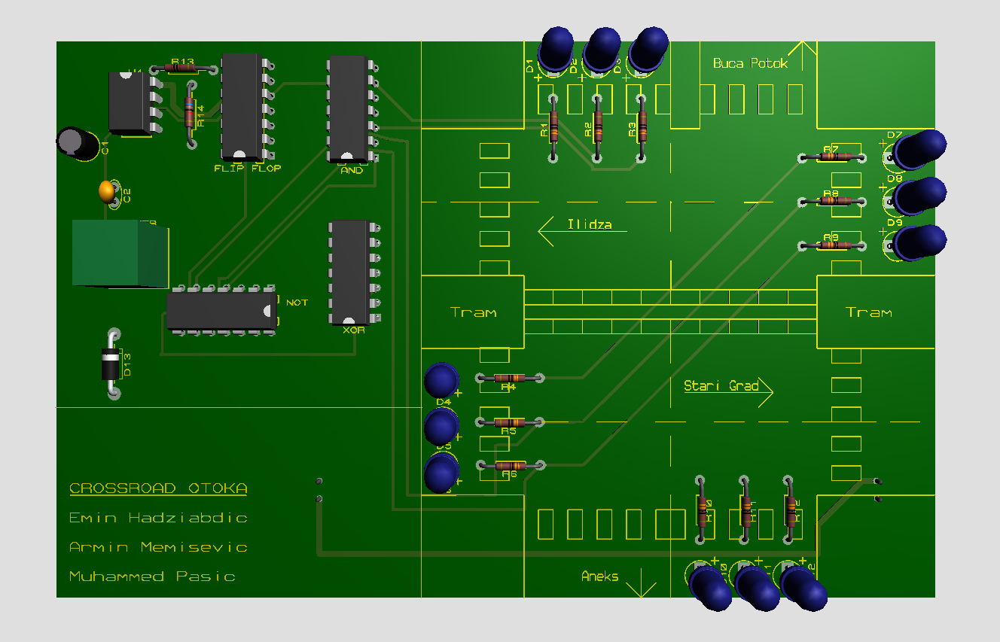

<div align="center">


# Crossroad Traffic Light Controller

**A hardware-realized digital logic control system modeling a 4-way urban intersection with integrated public transit prioritization, designed and routed for dual-layer PCB fabrication.**

**Academic Project** • Formal Models • Data Science and AI • ETF Sarajevo


</div>

## 🎯 Overview

The **Crossroad Traffic Light Controller** is a standalone, hardware-implemented digital automation system modeled after the high-traffic **Otoka Intersection** in Sarajevo. Developed as an advanced engineering project within the Data Science and Artificial Intelligence (DSAI) program at the Faculty of Electrical Engineering (ETF), University of Sarajevo, this project bridges mathematical logic design and practical PCB physical layout fabrication.

The circuit sequences the state transitions of a multi-lane urban crossroads, synchronizing primary roads, secondary roads, and a dedicated light rail (Tram) priority line. Built completely from foundational sequential and combinational logic blocks, it demonstrates optimization techniques in finite state machines (FSMs), hazard-free signal propagation, and high-reliability manual PCB routing using industrial design rules.

**Academic Context:**

- **Institution:** Faculty of Electrical Engineering (ETF), University of Sarajevo
- **Curriculum:** Data Science and Artificial Intelligence (DSAI)
- **Project Scope:** Schematic Analysis, Physical Footprint Mapping, Component Placement Strategy, and Precision Trace Routing

---

## ✨ Features

### Hardware & PCB Layout

- 🏎️ **Robust Trace Architecture:** Explicitly configured track topologies featuring **40-mil power highways** to ensure voltage stability, and **20-mil signal traces** to eliminate parasitic resistance variations.
- 📐 **Mitred Geometric Bends:** Pure $45^{\circ}$ manual routing strategies that optimize trace length, minimize electromagnetic susceptibility, and guarantee clean manufacturing etching paths.
- 🔋 **Flexible Power Input:** Native configuration designed to accept dual-terminal terminal block power, easily adaptable to standard 5.0V USB interfaces or standalone battery cell arrangements without line variations.
- 🔍 **Zero-Error DRC Verification:** Formally validated under strict Pre-Production Design Rule Checks (DRC) and Connectivity Rule Checks (CRC), resulting in 0 shorts, 0 opens, and absolute net list continuity.

### System Visualization

- 🗺️ **Geometrically Intuitive Layout:** LEDs are structurally partitioned on the board canvas into realistic geographic regions mapping the *Otoka* arterial routes: **Ilidža**, **Stari Grad**, **Buća Potok**, and **Aneks**.
- 🚃 **Integrated Transit Matrix:** High-visibility silkscreen markers delineating the **Tram** tracking lane running symmetrically through the intersection core.
- 🎭 **Component Socketing Design:** Built around dual-in-line standardized outlines (DIL) enabling rapid hardware maintenance and IC swapping via integrated protective sub-sockets.

---

## 🎥 Visual Previews

### 1. Schematic Capture


*Full structural logic schematic containing synchronized flip-flop registers, logic arrays, and downstream current-limiting resistor banks.*

### 2. 2D Copper Track Layout


*Finished double-sided routing layout view in Proteus. Red tracks correspond to Top Copper signal runs; Blue tracks illustrate Bottom Copper paths jumping beneath IC configurations.*

### 3. 3D Production Render



*Ray-traced 3D visual preview highlighting THT component alignment, white silkscreen lettering layers, and isolated structural board boundaries.*

---

## 🛠️ Hardware & Component Specifications

The design completely leverages **Through-Hole Technology (THT)** to ensure straightforward assembly, mechanical robustness, and simple physical soldering interfaces inside academic workshops.

### Integrated Circuit Subsystems

| Designation | Part Number | Package Type | Core Function |
| :--- | :--- | :--- | :--- |
| **U1** | `74HCT74` | DIP14 | Dual D-Type Positive-Edge-Triggered Flip-Flops (State Registers) |
| **U2** | `74HCT04` | DIP14 | Hex Inverter Arrays (Signal Inversion Logic) |
| **U3** | `74HC08` | DIP14 | Quad 2-Input AND Gates (Combinational Decoding Network) |
| **U4** | `74HCT86` | DIP14 | Quad 2-Input Exclusive-OR Gates (Next-State Phase Selection) |

### Discretes & Interconnect Modules

- **LED Array (5mm THT):**
  - 🔴 4x High-Efficiency Red LEDs (*D1, D4, D7, D10*)
  - 🟡 4x High-Efficiency Yellow LEDs (*D2, D5, D8, D11*)
  - 🟢 4x High-Efficiency Green LEDs (*D3, D6, D9, D12*)
- **Resistor Networks:**
  - ⚡ 12x 330 $\Omega$ Metal Film Axial Resistors (*R1–R12*, 0.25W, Tolerance $\pm1\%$) to constrain active LED current to a highly stable ~10–15mA.
- **Terminal Headers:**
  - 🔌 2x 2-Pin Heavy-Duty Screw Terminal Blocks (5.08mm physical pin pitch) dedicated to `POWER` delivery and external `CLOCK` signal generator line insertion.

---

## 📜 Circuit Operation & Logic Architecture

The crossroad automation functions as a clocked synchronous state machine that decodes current binary positions to alter multi-axis traffic patterns safely.

```txt
       [ Buća Potok ]
             ▲
             │
[ Ilidža ] ──┼── [ Stari Grad ]  (With Tram Overpass)
             │
             ▼
          [ Aneks ]
```

### 1. Sequential Timing & Registers

The state tracking sequence is managed by the dual D-type flip-flops (`74HCT74`) operating in tandem. Upon receiving an active rising edge from the input clock generator (`CLOCK`), the state bits transition based on the feedback loops routed through the `74HCT86` XOR network. This configuration forms a robust, hazard-free digital cyclic ring counter.

### 2. Decoder Combinational Matrix

The binary states are broadcasted across the `74HCT04` NOT gates and decoded by the array of `74HC08` AND arrays. These decoders map unique logic minterms to satisfy safety assertions, preventing catastrophic states (e.g., green signals active on conflicting axes concurrently).

### 3. Lane Interlock Mapping

- **Primary Axis (Ilidža $\longleftrightarrow$ Stari Grad):** Receives timing priorities configured to mirror high-throughput traffic load balances, working in tandem with the central Tram line indicators.
- **Secondary Axis (Buća Potok $\longleftrightarrow$ Aneks):** Cycles dynamically to allow crossroad access without starving the primary transportation veins.

---

## 🏗️ PCB Architecture & Design Rules

The underlying double-sided copper structure was built manually to maintain short path constraints and protect logic inputs from ground bounce transitions.

```txt
Project Layout Stackup/
├── Top Silk Layer        # White Component Outlines, Orientation Notches, Road Names
├── Top Copper Layer      # Red Traces (Primary horizontal routing highways, T20)
├── Inner Isolation       # Rigid FR4 Fiberglass Substrate Core
├── Bottom Copper Layer   # Blue Traces (Secondary vertical track hopping, T40/T20)
└── Bottom Solder Mask    # Protective green anti-bridging chemical layer
```

### Critical Trace Layout Constants

- **Power Bus Routing (`VCC` / `GND`):** Set entirely to style **T40 (40 mil / 1.02mm)**. Thicker cross-sections reduce resistance lines, maintaining clear voltage margins for all four logic ICs simultaneously.
- **Signal Line Routing:** Set consistently to style **T20 (20 mil / 0.51mm)**. This parameter provides structural toughness against potential track liftoff issues while safely managing low-level gate current steps.
- **Drill Hole Clearance:** Standardized through-hole pad configurations optimized for common $0.8\text{mm} - 1.0\text{mm}$ component pin leads to allow unhindered solder wetting curves.

---

## 💾 Manufacturing & Standalone Deployment

### Gerber Generation Workflow

The PCB files have been fully exported using modern industry protocols to allow instant ordering across external fab houses (*JLCPCB, PCBWay, Eurocircuits*):

- **Format Engine:** Gerber X2 (RS-274X backwards-compatible) containing absolute imperial coordinates with zero embedded rounding tolerances.
- **Layer Container Pack:** Embedded into a deployment-ready `.zip` structure including `.GTL` (Top Copper), `.GBL` (Bottom Copper), `.GTO` (Top Silk), `.GTS`/`.GBS` (Solder Resist Masks), and `.TXT`/`.DRL` (Excellon Hardware Drill Maps).

### Standalone Power Configurations

To maintain mobile, un-tethered operation during laboratory demonstrations or presentations, use either of these low-cost standalone interfaces:

- **Option 1 (USB Mobile Deployment):** Cut an old Type-A USB cable to expose its inner wire jacket. Strip away the green and white data wires, and route the **Red (+5V)** and **Black (GND)** raw power cores straight into the `POWER` screw terminal block. Hook up the cable to any standard mobile USB power bank block for days of standalone processing.
- **Option 2 (AA Battery Cell Pack):** Implement a standard external 4x AA enclosure containing an integrated On/Off sliding switch. When utilizing alkaline cells ($4 \times 1.5\text{V} = 6.0\text{V}$), place a small **1N4007 silicon diode** inline with the positive line to step down the native output voltage to a perfectly safe $\sim5.3\text{V}$ threshold before it connects into the PCB block.

---

## 👥 Team

### Project Engineering Team

- **Emin Hadžiabdić**
  - Circuit Schematic Design & Structural Capture
  - Double-Sided PCB Layout Routing & Track Optimization (T20/T40)
  - Pre-Production Design Rule Check (DRC/CRC) Validation

- **Armin Memišević**
  - Finite State Machine (FSM) Logical Formulation
  - Circuit Drawing Logic & Schematic Diagrams Setup
  - Digital Sequencing & Logic Minimization Simulation

- **Muhammed Pašić**
  - Through-Hole Technology (THT) Physical Soldering & Assembly
  - Component Sourcing & Mechanical Board Implementation
  - Hardware Continuity Deployment & Laboratory Presentation Readiness

---

⭐ Star this repository if this physical digital logic layout framework helped your engineering lab workflow!
